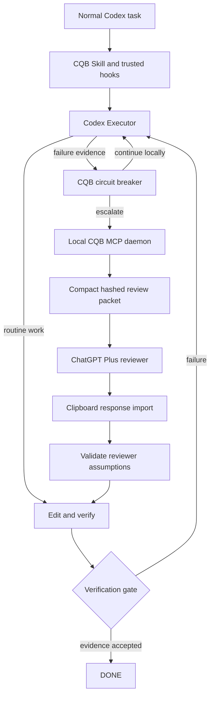

# Codex Quota Bridge

[English](README.md) | [简体中文](README.zh-CN.md)

Codex Quota Bridge (CQB) is a local reasoning-offload and quota-optimization companion for Codex. Codex remains the Executor; CQB interrupts diminishing-return retry loops, compresses engineering evidence, and routes occasional high-value decisions to a dedicated ChatGPT Plus reviewer conversation.

## Architecture



The plugin bundles one routing Skill, a local STDIO MCP server, and Codex lifecycle hooks. Runtime state, review artifacts, and events are persisted locally. The daemon is managed as a background MCP child process by Codex, so normal use does not require a separate terminal.

## MVP capabilities

- Seven stable CQB tools: `cqb_status`, `cqb_should_escalate`, `cqb_request_review`, `cqb_bind_reviewer`, `cqb_review_status`, `cqb_get_review`, and `cqb_report_result`.
- Explicit persistent task states and validated transitions.
- A two-failure circuit breaker, consultation limits, round limits, repeated-failure detection, and a new-evidence requirement.
- Review packets with bounded content, common-secret redaction, size estimates, and SHA-256 payload binding.
- Review packets detect the original `user_input` language and explicitly direct the expert to answer in Simplified Chinese (`zh-CN`) or English (`en`); callers without `user_input` use the task goal as a fallback.
- Safe, Assisted, and explicitly consented Autopilot permission modes.
- Chrome/Edge PID and HWND continuity, exact conversation URL, and ChatGPT composer-focus verification before every paste or send.
- Explicit reviewer-response import only while `WAITING_FOR_REVIEW`.
- A completion gate that independently runs configured commands and inspects Git state.
- A complete mocked acceptance flow.

## Quick start

Requirements: Windows, Node.js 22 or newer, Git with the target project inside a worktree, pnpm, and Codex CLI 0.153.3 or newer.

```powershell
pnpm install
pnpm build
pnpm test
pnpm demo
```

Install the local plugin:

```powershell
.\scripts\install.ps1
```

Start a new Codex task after installation, review and trust the bundled hooks, then continue using Codex normally. Configure a dedicated ChatGPT conversation and keep Safe mode enabled until the exact target title is stable.

For Codex desktop, CQB uses the built-in Browser by default. On the first review request it automatically opens `@Browser`, searches for the dedicated reviewer conversation, and opens it when found. If no matching conversation exists, Codex proposes creating one named `CQB Reviewer`, then persists the confirmed `/c/...` URL through `cqb_bind_reviewer`. No shell command or CQB-specific prompt is required. Codex CLI keeps the local fallback: run `cqb setup-reviewer` and complete the Chrome/Edge confirmation flow. Use `--window-title "CQB Reviewer"` for a stable local title substring.

See [Windows installation](docs/windows-installation.md) for the complete setup and update flow.

## Normal and difficult tasks

Routine work stays inside Codex. On a difficult task, the CQB Skill registers state, records concrete failed approaches, and asks the circuit breaker whether the evidence justifies escalation. An accepted review request is copied to the clipboard and the configured ChatGPT conversation is opened in Safe mode. Copy the reviewer response, then let Codex pass that text to `cqb_get_review`; CQB accepts it only from the waiting state and instructs Codex to verify the advice before editing.

## Automation modes

- Safe: CQB creates and copies the request, returns a built-in Browser host action in Codex desktop, and notifies the user. It performs no focus, paste, or send input.
- Assisted: CQB binds the Chrome/Edge PID and HWND, verifies the exact address-bar conversation URL, focuses the ChatGPT composer through Windows UI Automation, verifies again, and pastes. The user reviews and submits.
- Autopilot: CQB persists a payload-hash reservation before desktop input, requires an empty composer before paste, reads the composer back and matches the complete CQB payload before Enter, and sends only after exact persisted consent. The per-task automatic review limit remains enforced across restarts.

All target or payload mismatches fail closed and leave the request available for manual handling.

See [Security](docs/security.md) before enabling Assisted or Autopilot.

## Runtime files

Each task is stored under `%CODEX_HOME%\cqb\tasks\<task-id>\` by default:

```text
task.json
events.jsonl
review-request.md
consultation.json
review-response.md
final.json
```

Events redact credential-shaped fields and common bearer/key strings. CQB does not intentionally store cookies, credentials, or unrelated clipboard content.

## Metrics

CQB records executor rounds, local failures, expert reviews, automatic reviews, retries prevented, estimated packet size, approximate compression, duration timestamps, and verification outcomes. These measure context reduction, avoided retries, and review offload; they are not exact Codex quota savings.

The shipped configuration profiles are `config.example.yaml` (Safe), `config.assisted.example.yaml`, and `config.autopilot.example.yaml`. The installer creates `%CODEX_HOME%\cqb\config.yaml` once and preserves it on later updates.

Disable all automatic input immediately with:

```powershell
node .\dist\cli\index.js automation disable
```

## Documentation

- [Integration decision](docs/integration-decision.md)
- [Windows installation](docs/windows-installation.md)
- [Security](docs/security.md)
- [Current limitations](docs/limitations.md)
- [Roadmap](docs/roadmap.md)
- [Implementation plan](docs/superpowers/plans/2026-09-05-codex-quota-bridge-mvp.md)
