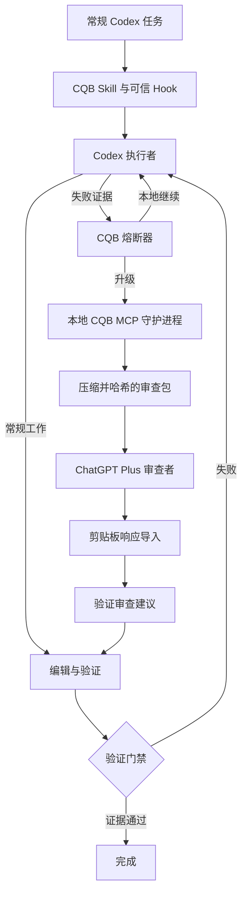

# Codex 配额桥

[English](README.md) | [简体中文](README.zh-CN.md)

Codex Quota Bridge（CQB）是面向 Codex 的本地推理卸载与配额优化工具。Codex 始终作为执行者；CQB 会中止收益递减的重试循环、压缩工程证据，并将少量高价值决策转交给专用的 ChatGPT Plus 审查会话。

## 架构



该插件包含一个路由 Skill、本地 STDIO MCP 服务器和 Codex 生命周期 Hook。运行时状态、审查产物和事件均持久化在本地。守护进程由 Codex 作为后台 MCP 子进程管理，因此日常使用无需单独打开终端。

## MVP 功能

- 七个稳定的 CQB 工具：`cqb_status`、`cqb_should_escalate`、`cqb_request_review`、`cqb_bind_reviewer`、`cqb_review_status`、`cqb_get_review` 和 `cqb_report_result`。
- 明确、可持久化的任务状态及经过验证的状态转换。
- 两次失败熔断、咨询次数限制、执行轮次限制、重复失败检测及新证据要求。
- 具备内容边界、常见秘密脱敏、大小估算和 SHA-256 载荷绑定的审查包。
- 审查包会检测原始 `user_input` 的语言，并明确要求专家使用简体中文（`zh-CN`）或英文（`en`）回复；未提供 `user_input` 时回退到任务目标。
- Safe（安全）、Assisted（辅助）和需明确授权的 Autopilot（自动）权限模式。
- 在每次粘贴或发送前验证 Chrome/Edge PID、HWND 连续性、精确会话 URL 和 ChatGPT 编辑框焦点。
- 仅在 `WAITING_FOR_REVIEW` 状态下显式导入审查响应。
- 独立执行配置命令并检查 Git 状态的完成门禁。
- 完整的模拟验收流程。

## 快速开始

环境要求：Windows、Node.js 22 或更高版本、位于 Git 工作树中的目标项目、pnpm，以及 Codex CLI 0.153.3 或更高版本。

```powershell
pnpm install
pnpm build
pnpm test
pnpm demo
```

安装本地插件：

```powershell
.\scripts\install.ps1
```

安装后新建 Codex 任务，检查并信任插件提供的 Hook，然后照常使用 Codex。请配置专用 ChatGPT 会话，并在目标窗口标题稳定前保持 Safe 模式。

在 Codex 桌面版中，CQB 默认使用内置 Browser。首次发起审查请求时，CQB 会自动打开 `@Browser`，搜索专用审查会话，找到后直接打开。如果没有匹配会话，Codex 会提出创建名为 `CQB Reviewer` 的新会话，并通过 `cqb_bind_reviewer` 保存确认后的 `/c/...` URL。不需要输入 Shell 命令或 CQB 专用提示词。Codex CLI 继续使用本地回退流程：运行 `cqb setup-reviewer` 完成 Chrome/Edge 确认；需要稳定的本地窗口标题片段时，可添加 `--window-title "CQB Reviewer"`。

完整的安装和更新流程请参阅 [Windows 安装说明](docs/windows-installation.zh-CN.md)。

## 常规与困难任务

常规工作始终在 Codex 内完成。遇到困难任务时，CQB Skill 会登记状态、记录具体失败方案，并由熔断器判断现有证据是否足以升级。通过的审查请求会复制到剪贴板，并在 Safe 模式返回内置 Browser 操作。复制审查响应后，由 Codex 将文本传给 `cqb_get_review`；CQB 仅在等待状态下接收响应，并要求 Codex 在编辑前验证建议。

## 自动化模式

- Safe（安全）：CQB 创建并复制请求，在 Codex 桌面版返回内置 Browser 宿主操作并通知用户；不会执行聚焦、粘贴或发送输入。
- Assisted（辅助）：CQB 绑定 Chrome/Edge PID 和 HWND，验证地址栏中的精确会话 URL，通过 Windows UI Automation 聚焦 ChatGPT 编辑框，再次验证后粘贴；由用户审阅并提交。
- Autopilot（自动）：CQB 在桌面输入前持久化载荷哈希预留，粘贴前要求编辑框为空，在按下 Enter 前回读编辑框并匹配完整 CQB 载荷，且仅在精确授权已持久化后发送；每个任务的自动审查上限在重启后仍然有效。

任何目标或载荷不匹配都会以关闭方式失败，并保留请求供手动处理。

启用 Assisted 或 Autopilot 前请阅读 [安全模型](docs/security.zh-CN.md)。

## 运行时文件

默认情况下，每个任务存储在 `%CODEX_HOME%\cqb\tasks\<task-id>\` 下：

```text
task.json
events.jsonl
review-request.md
consultation.json
review-response.md
final.json
```

事件会对类似凭据的字段及常见 bearer/key 字符串进行脱敏。CQB 不会主动存储 Cookie、凭据或无关的剪贴板内容。

## 指标

CQB 会记录执行轮次、本地失败次数、专家审查次数、自动审查次数、避免的重试次数、审查包估算大小、近似压缩率、时长时间戳和验证结果。这些指标用于衡量上下文缩减、避免的重试和审查卸载，并不代表精确的 Codex 配额节省量。

随附的配置文件包括 `config.example.yaml`（Safe）、`config.assisted.example.yaml` 和 `config.autopilot.example.yaml`。安装程序首次运行时创建 `%CODEX_HOME%\cqb\config.yaml`，后续更新会保留该文件。

使用以下命令立即禁用所有自动输入：

```powershell
node .\dist\cli\index.js automation disable
```

## 文档

- [集成方案](docs/integration-decision.zh-CN.md)
- [Windows 安装说明](docs/windows-installation.zh-CN.md)
- [安全模型](docs/security.zh-CN.md)
- [当前限制](docs/limitations.md)
- [路线图](docs/roadmap.md)
- [实施计划](docs/superpowers/plans/2026-09-05-codex-quota-bridge-mvp.md)
